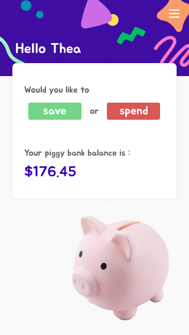

# My Piggybank

## Overview

My Piggybank is an app geared towards preschoolers and grade school children to begin teaching them what spending and saving money means. It's a fun way for them to visualize how much money goes in/out of their own piggybank and always keep track of how much is in there.

### Problem

Kids who have a piggybank rarely know how much is in there unless they periodically take all the money out and count it, this app allows them to always know the contents of their piggybank by recording whenever they put in or take out money.

### User Profile

Preschool age

### Features

- One page application that provides simple yet effective way for kids to keep track of their piggybank contents.
- Button to "save" and "spend" where they can determine how much money is going in and out, and what type of bills/coins are being used.
- Total money is displayed boldly so they can easily see how much money they have.

## Implementation

## Tech Stack

- React.js
- Node.js
- PostgresSQL
- Client libraries
  - react-router-dom
  - sass
  - axios
- Server libraries
  - express
  - knex
  - cors
  - dotenv

### Mockups

### Data

### Endpoints

### Auth

## Installation
